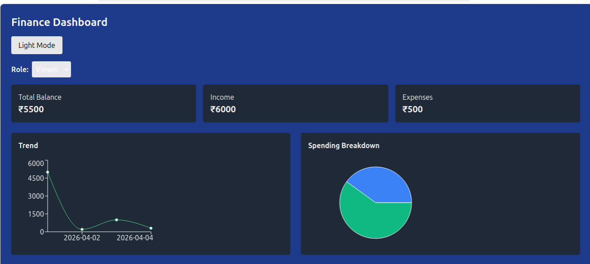

# 💰 Finance Dashboard

A modern and responsive **Finance Dashboard** built using **Vite + Vanilla JavaScript**. This project provides a clean UI to visualize financial data such as income, expenses, balance, and transactions.

---

## 🚀 Live Demo

🔗 https://harika655.github.io/finance-dashboard/

---

## 📌 Features

* Interactive dashboard UI
* Income & Expense tracking
* Financial summary cards
* Transaction history display
* Fully responsive (mobile, tablet, desktop)
* Fast performance using Vite

---

## 🛠️ Tech Stack

* **Frontend:** HTML, CSS, JavaScript,react js
* **Build Tool:** Vite
* **Version Control:** Git & GitHub

---

## 📁 Project Structure

```
finance-dashboard/
│── public/
│── src/
│   ├── assets/
│   ├── css/
│   ├── js/
│── index.html
│── package.json
│── vite.config.js
│── dist/ (generated after build)
```

---

## ⚙️ Installation & Setup

### 1️⃣ Clone the repository

```
git clone https://github.com/harika655/finance-dashboard.git
cd finance-dashboard
```

### 2️⃣ Install dependencies

```
npm install
```

### 3️⃣ Run development server

```
npm run dev
---

## 📸 Screenshots




---

## ✨ Future Improvements

* User authentication
* Charts & graphs integration
* Backend integration (Node.js / Django)
* Cloud data storage

---

## 🤝 Contributing

Contributions are welcome!
Feel free to fork this repo and submit a pull request.

---

## 📄 License

This project is licensed under the **MIT License**.

---

## 👩‍💻 Author

**Harika T**

* GitHub: https://github.com/harika655
* LinkedIn: https://www.linkedin.com/in/harika-t-b1731b222

---
